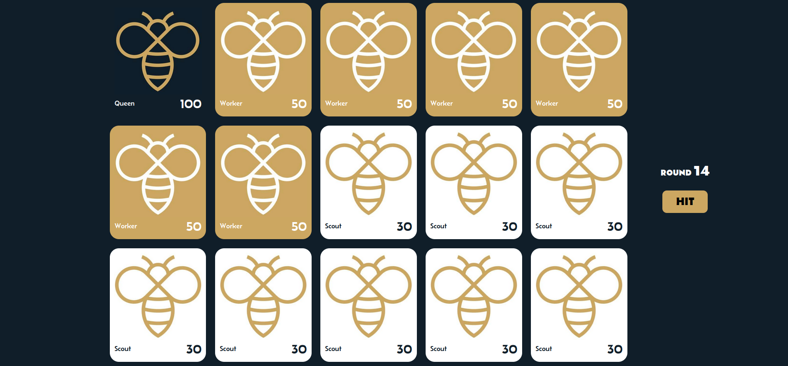
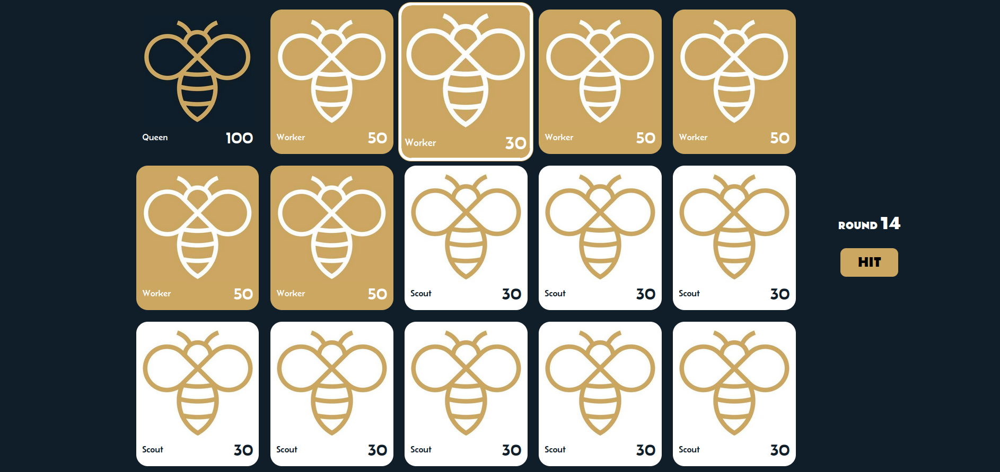
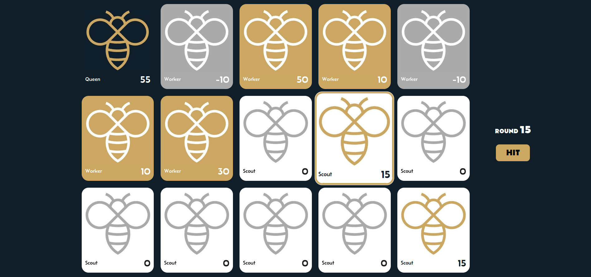
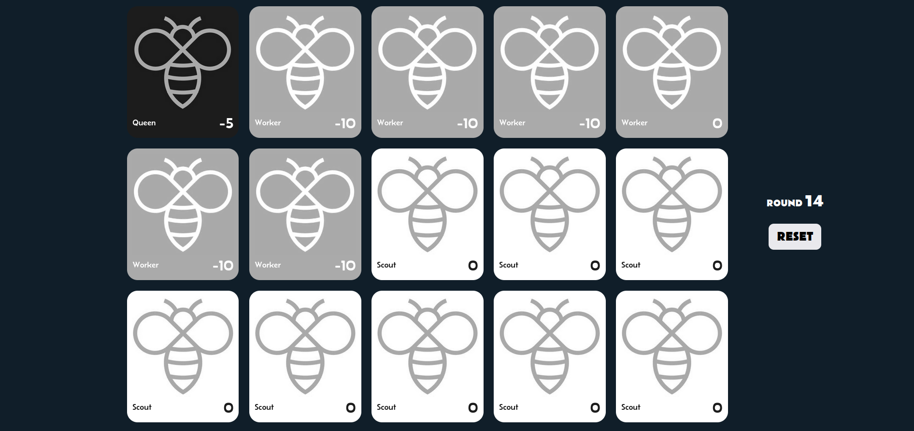

# BEES
[bees-test.webm](https://github.com/nora-sch/Bees/assets/62623658/41cb9f29-51ed-495f-9957-aca5d7910821)


To start game in browser with address http://localhost:3000/ - 
it's necessary to run the following command in terminal from the root directory:
```
php -S localhost:3000
```
## Specifications
-----------------
There are 3 different types of bees:

- The Queen
	- has 100 hit points
	- when the Queen is hit, then 15 hit points is deduced from her lifespan
	- when the Queen is running out of hit points, all the other bees are automatically out of hit points
	- there is only 1 Queen in the game

- The Worker
	- each has 50 hit points
	- when a worker is hit, he loses 20 hit points
	- there are 5 Workers at start 

- The Scout
	- each has 30 hit points
	- when a scout is hit, he loses 15 hit points
	- there are 8 Scouts at start


## Gameplay 
-----------
On the UI :
	- the list of bees associated with their role (Queen, Worker, Scout) and remaining hit points
	- a clickable "hit" button

When the button is clicked:

	- a random bee is selected 
	- the correct damages are deduced from its lifespan

  

	- if an bee is running out of hit points, then it cannot be randomly selected again

  

	- when all bees are running out of hit points, then the game ends and it is possible to reset it for the next round.

  

